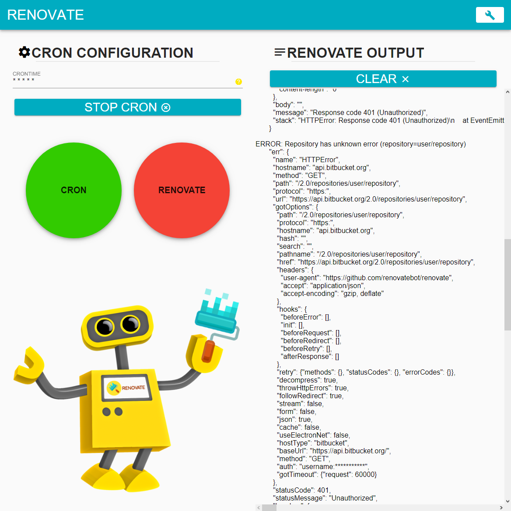
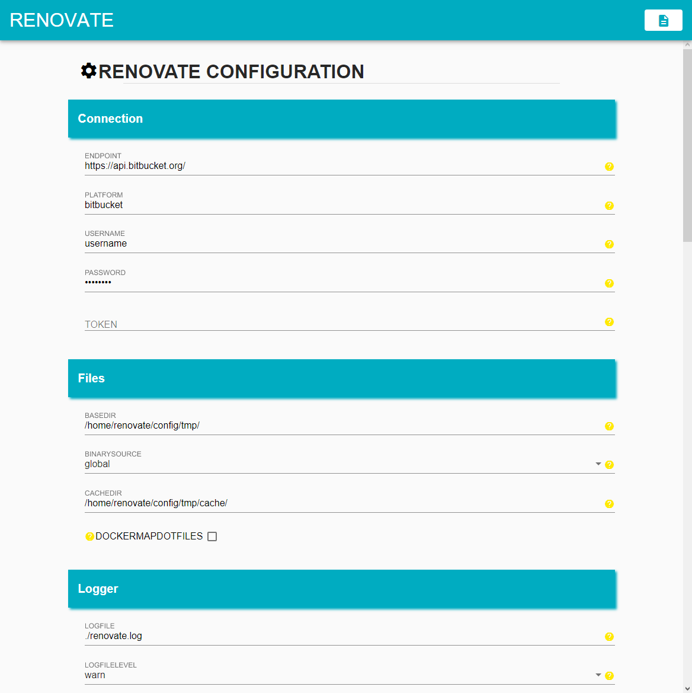
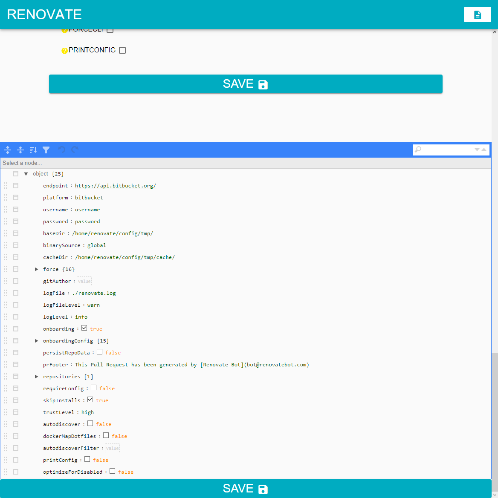

# RenovateController

## Intro
RenovateController is a graphical user interface to configure, execute and observe the [Renovate Bot](https://renovatebot.com).
You can use `docker` to start and run the whole project inside a node container. The execution of the renovate job itself is all based on a configurable cron job.


### Overview

The GUI consists of two pages:
* the homepage ( `/` )
* the configuration page ( `/config` )

The homepage is the place to configure and observe the RenovateController itself. You can start/stop the cron job and configure its execution time, observe the states of the cron job and the [Renovate Bot](https://renovatebot.com), and even watch the console-output of a running renovate execution.



On the configuration page is a form to do the configuration for the [Renovate Bot](https://renovatebot.com). Of the, so called, "onboardingConfig" there are only essential configuration options inside the form because of its huge range. To fully use all of its options, there is a JSON-editor placed on the end of the page where you can add and edit all available options.
A documentation of all configuration options can be found inside the [Renovate Docs](https://docs.renovatebot.com).




### Getting started

RenovateController can be run easily using `docker`. Before running `docker-compose` you will need to execute `yarn build` inside the project's root folder first to build the nestjs server and the angular client. Make sure the build did success on both. Then you can create and start the docker container using `docker-compose up`. This will create a node container, install renovate and the needed dependencies and finally start the server, which serves the client. The client should be running on port 80.

```shell
yarn build
docker-compose up
```